this is my readme because you cant access my private repo

# Souhayle Ouaabi's Project Portfolio

## Introduction
This repository showcases the diverse range of projects I've worked on, demonstrating my expertise in data science, artificial intelligence, chatbot development, and more. The projects are grouped into different categories, highlighting the key technologies and methodologies used.

## Projects

### Reinforcement Learning
#### CartPole with Q-Learning and Policy Gradient
- Implemented Q-Learning and Policy Gradient algorithms to solve the CartPole balancing problem.
- Compared the performance of both approaches in this classic control task.

#### DDQN on Racing Car
- Applied Double Deep Q-Network (DDQN) to train an agent for a racing car environment.
- Explored improvements over traditional DQN for more stable learning in complex driving scenarios.

- - 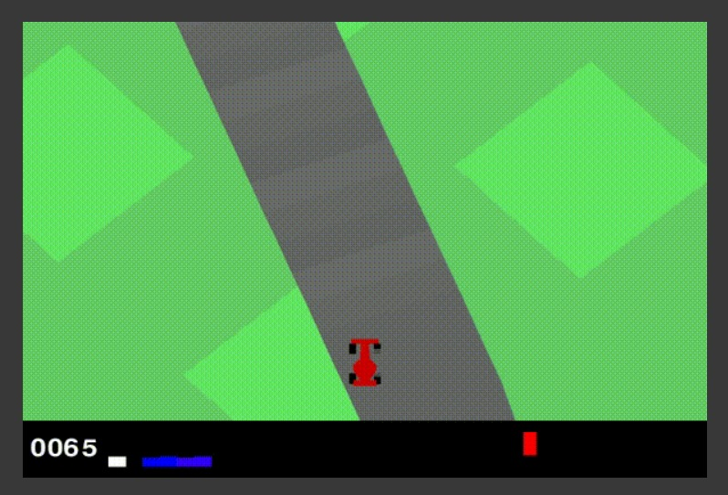

#### Energy Environment Creation and Optimization with PPO
- Developed a custom environment simulating energy management scenarios.
- Implemented Proximal Policy Optimization (PPO) to optimize energy allocation and consumption.

- 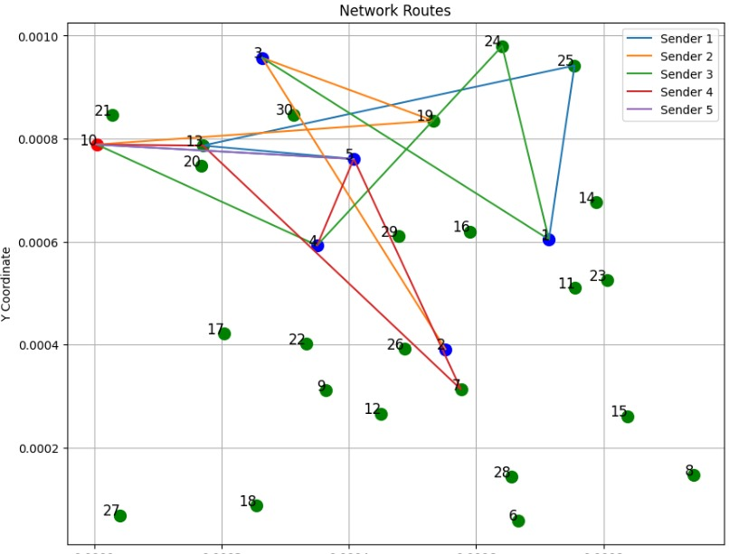

#### Grid World RL
- Created a Grid World environment to demonstrate fundamental RL concepts.
- Implemented and compared various RL algorithms in this discrete state-action space.

#### Trading Actions with RL
- Designed an RL environment to simulate financial trading scenarios.
- Trained agents to make profitable trading decisions using RL techniques.

#### Truck Packing Environment and RL Solution
- Developed a custom environment for optimizing truck packing and logistics.
- Implemented RL algorithms to learn efficient packing strategies, maximizing space utilization.

  
- 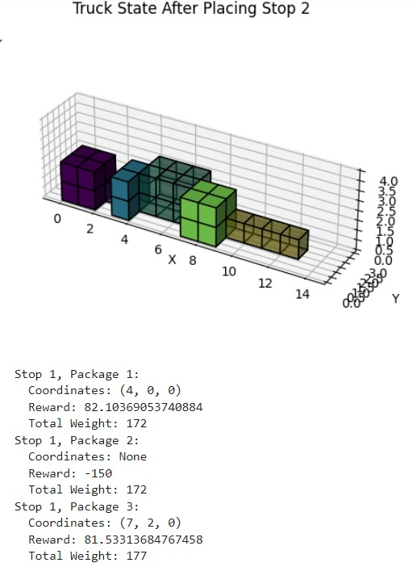

### Natural Language Processing (NLP)
#### NLP Classification on Rotten Tomatoes
- **Basic NLP Classification**: Implemented text preprocessing, tokenization, and feature extraction. Applied machine learning algorithms like Naive Bayes, Logistic Regression, and Support Vector Machines (SVM) for text classification.
- **LSTM and Deep LSTM Models**: Utilized Long Short-Term Memory (LSTM) networks to capture sequential information in movie reviews. Experimented with different LSTM architectures to improve classification performance.

#### PEFT: Parameter-Efficient Fine-Tuning for LLMs
- **Efficient Fine-Tuning Techniques**: Investigated various PEFT techniques such as adapters, prefix tuning, and low-rank adaptation. Implemented and compared different PEFT methods to identify the most effective approach.
- **Resource Optimization**: Analyzed the trade-offs between fine-tuning efficiency and model performance. Optimized the fine-tuning process to reduce computational requirements without significant performance degradation.

#### Customer Request Classification
- Designed and developed an advanced classification model to analyze customer requests, enabling automated and personalized responses using NLP techniques, TensorFlow, and deep learning approaches.

### Langchain Projects
#### Data Analyst Chatbot
- **CSV Agent with Langchain**: Developed a chatbot that can interact with and analyze data stored in CSV files using Langchain’s agents and tools.
- **SQL Agent with Langchain**: Created a chatbot that can interact with databases using SQL queries through Langchain’s SQL agent.
- **Deep SQL Chain with Langchain**: Built a SQL agent from scratch using Langchain’s components and abstractions, implementing a deep learning model to generate SQL queries based on user input.

#### Financial Market Decision Support Chatbot
- Developed a RAG-based chatbot to assist financial market professionals in decision-making, processing complex PDF documents containing text, images, and tables using LangChain, FAISS, Unstructured, and Embeddings.

- - 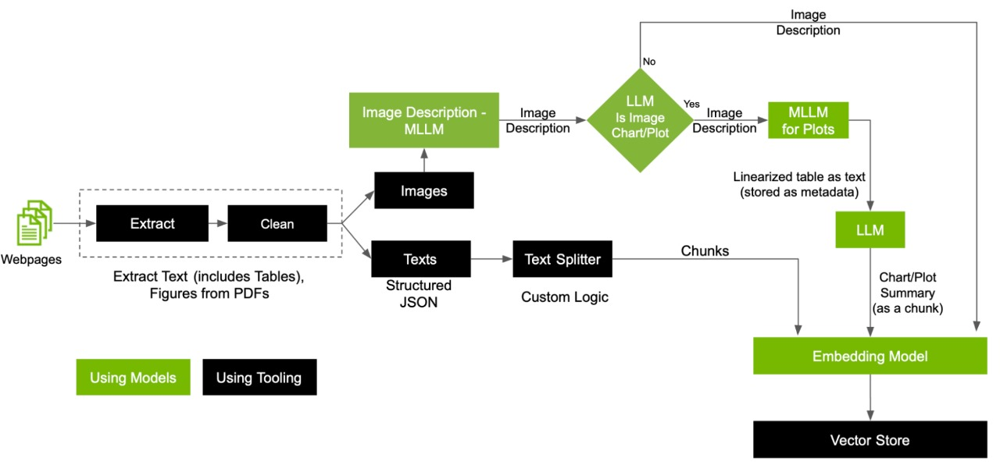
- - 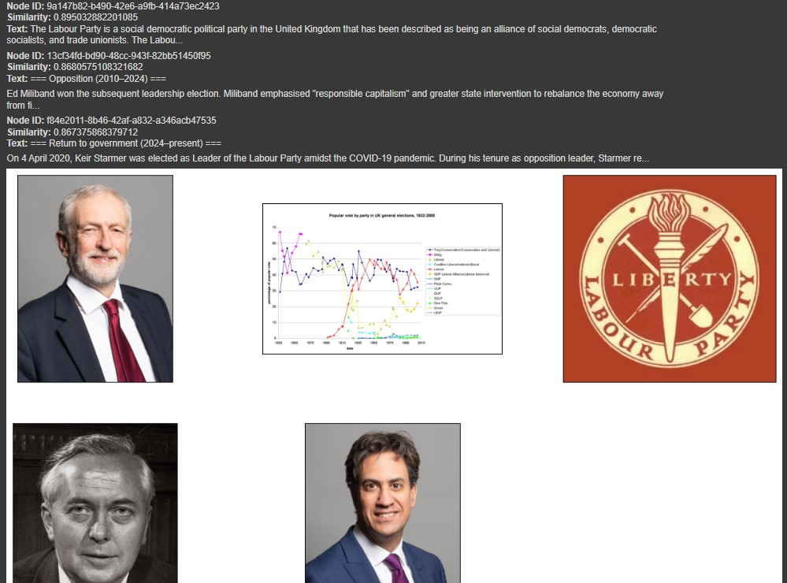

### Computer Vision
#### Breast Cancer Immunohistochemical Image Generation
- Developed a model for generating synthetic immunohistochemical images of breast cancer tissue.

#### Computer Vision Processing (Harrison)
- Implemented various computer vision techniques based on Harrison's methodologies.

#### Image-to-Image Translation (Pix2Pix)
- Created a model for translating images from one domain to another using the Pix2Pix architecture.

#### LIME and SHAP for Emotions
- Applied LIME (Local Interpretable Model-agnostic Explanations) and SHAP (SHapley Additive exPlanations) to interpret emotion recognition models.

#### Multilabel Classification of Diseases
- Developed a model for classifying multiple diseases from medical images.

#### Segmentation Model using MobileNet
- Implemented an image segmentation model using the lightweight MobileNet architecture.

#### Transfer Learning vs Fine-tuning
- Conducted a comparative study between transfer learning and fine-tuning approaches in computer vision tasks.

#### VGG Fine-tuning
- Fine-tuned a VGG network for a specific computer vision task.

### Multimodal Models
#### Multimodal Multilabel Disease Classification
- Created a multimodal multilabel classification model to predict diseases from textual data and radiographic images using PyTorch.
- Utilized DenseNet121 for image processing and bidirectional LSTM for text analysis.
- Implemented a custom dataset class (ChestXrayDataset) to handle multimodal data.
- Developed a combined architecture (MultimodalDenseNetLSTM) that fuses image and text features.
- Applied various evaluation metrics including ROC AUC, PR AUC, precision, recall, and F1-score.
- Implemented early stopping and learning rate scheduling for optimal training.

### Time Series Forecasting
#### Birth Forecasting
- Forecasted child births in all provinces of Spain using LSTM networks and TensorFlow, applying time series analysis and forecasting techniques.

### Machine Learning Projects
#### Patient Analysis and Disease Prediction
- **Feature Engineering**: Created a wide range of features from patients' blood sample levels, applying feature selection techniques to identify the most informative ones for predictive models.
- **Disease Prediction**: Developed machine learning models to predict the likelihood of a patient contracting a specific disease based on blood sample features, optimizing models for high accuracy.
- **Healing Time Forecasting**: Built regression models to estimate healing time for patients diagnosed with specific diseases, based on patient characteristics and treatment factors.

#### Synthetic Data Creation and RUL Prediction
- **Synthetic Data Creation**: Generated synthetic battery data mimicking real-world battery data characteristics, expanding the dataset for better model training.
- **Battery Capacity Prediction**: Developed a predictive model to estimate battery capacity after multiple charging and discharging cycles, employing machine learning algorithms for accurate predictions.

#### Football Analysis and Prediction
- **Clustering of Formations**: Analyzed data from Bundesliga matches to cluster formations used during games, identifying common patterns and strategies using clustering algorithms.
- **Event Prediction**: Developed a predictive model to forecast the type of movement in a football match, such as overlaps or runs behind the defense, using machine learning techniques.

- 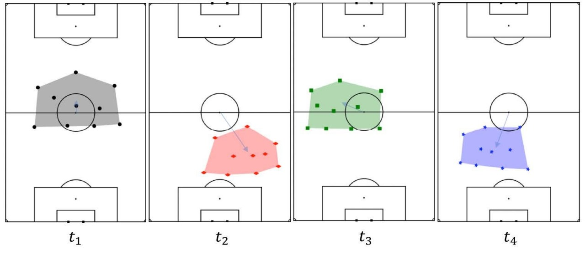

- 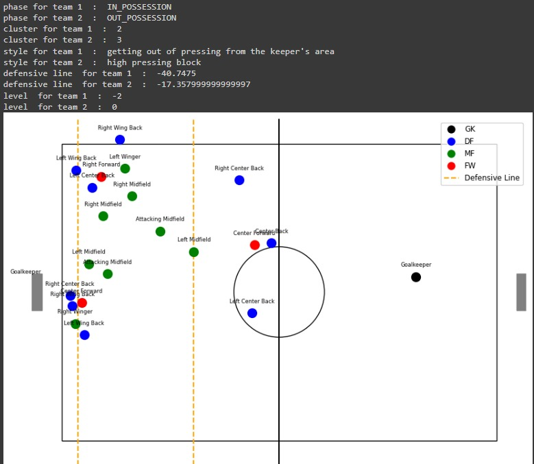

  
#### Movie Recommendation System
- Designed an innovative movie recommendation system employing collaborative filtering techniques to offer personalized suggestions using TensorFlow and Pandas.

#### Tennis Padel Stroke Classification
- Developed a model integrated into a wearable device to classify tennis strokes in real-time based on multi-axis sensor data using TensorFlow and signal processing techniques.

### Web Scraping and Data Analysis
#### LinkedIn Job Market Analysis and Lead Generation
- Developed a web scraping system to extract job offers from LinkedIn for Morocco and numerous other nations across all continents.
- Conducted comprehensive data analysis using Matplotlib, Seaborn, and Power BI to visualize trends and insights in the global job market.
- Created a job matching model using Natural Language Processing (NLP) and Deep Learning techniques to align job seekers with suitable opportunities.
- Scraped profiles of LinkedIn users to collect relevant data for lead generation.
- Utilized Selenium WebDriver to automate the data extraction process from LinkedIn profiles.
- Processed and structured the raw data into JSON format for further analysis and utilization.
- Tools used: Web scraping libraries, Power BI, NLP frameworks, Deep Learning libraries, Selenium, Python, JSON.
- 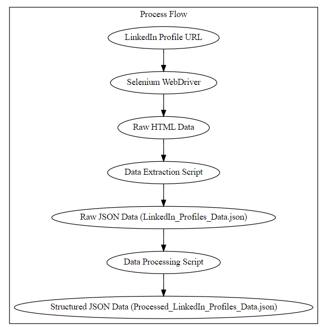
- 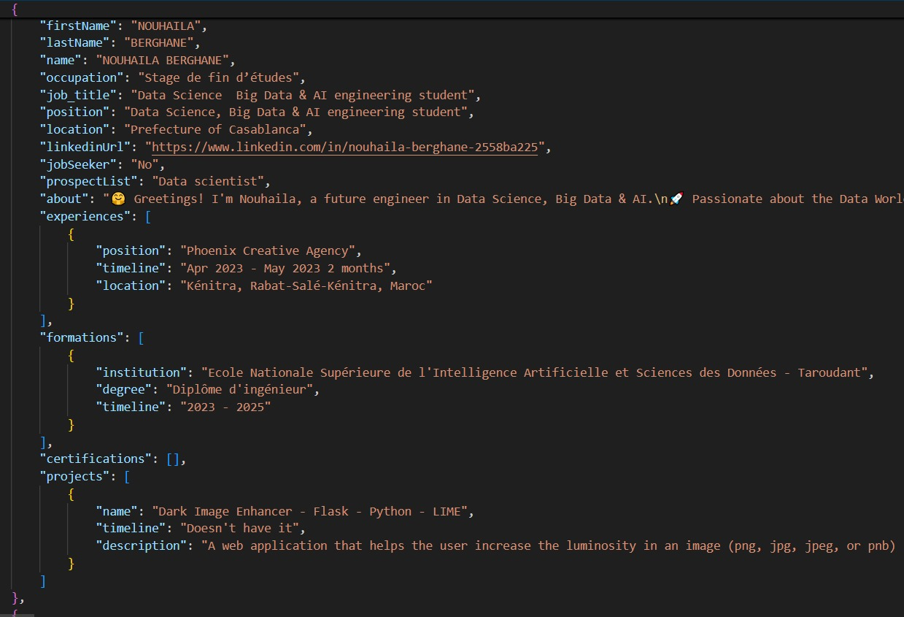
- 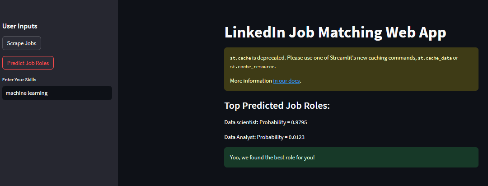
- 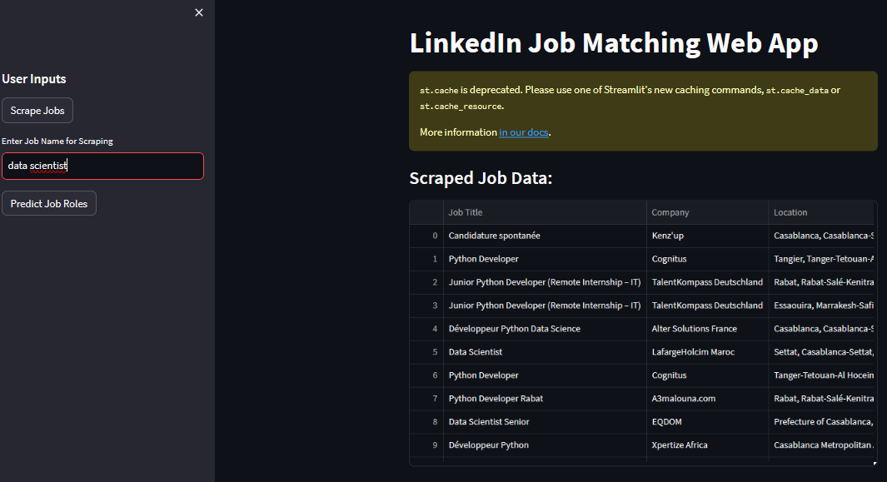

#### Scraping and Analysis of Territorial (US) and Sports Data
- Developed an automated system for collecting and analyzing data on sports camps and demographic data through web scraping using Python.
- Processed and analyzed information contained in PDFs using LangChain and language models (LLMs).
- Automatically generated detailed reports in PDF format with LaTeX.

## Contact
For more information, please contact [Souhayle Ouaabi](mailto:souhayle.ouaabi99@gmail.com).
